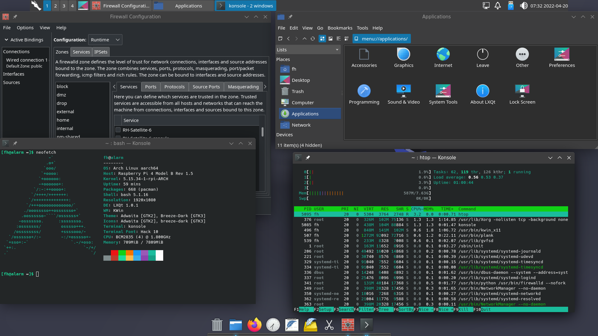

# lxqt-kwin

Arch lxqt-kwin setup




## setup

* install a barebone system
* install git
* clone this repo
* cd into the folder
* follow the checklist

### checklist
- [ ] `pacman -Syu --needed - < $PWD/Packages-Desktop`
- [ ] `systemctl enable NetworkManager`
- [ ] `systemctl enable sddm`
- [ ] `systemctl enable firewalld`
- [ ] `cp -r $PWD/etc/. /etc/`
- [ ] `cp -r $PWD/usr/. /usr/`
- [ ] `cp -r $PWD/root/. /root/`
- [ ] `useradd -mUG lp,wheel,network,video USERNAME`
- [ ] `passwd USERNAME`

### slightly automated

* an alternative is to run the `setup.sh` - simply provide your desired username as argument for setup.sh
   ```
   bash setup.sh <username>
   ```
